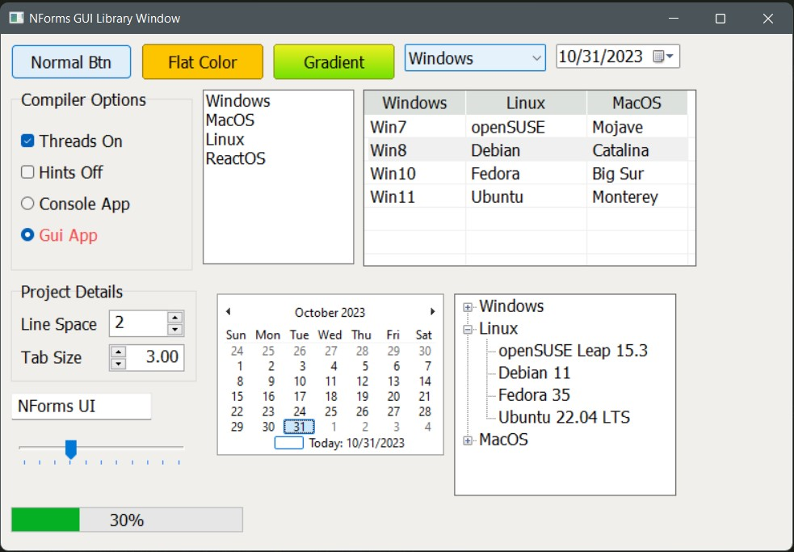

# Nforms GUI Library for Windows
## A simple GUI library for Nelua programming language. Based on Windows API

## Screenshots



## Code for the above screenshot
```lua

require "nforms"

local frm = Form.new("NForms GUI Library Window", 800, 550)
frm:createHandle()


local b1 = Button.new{frm, "Normal Btn", create = true}
local b2 = Button.new{frm, "Flat Color", xpos = right(b1, 10), 10, create = true}
b2:setBackColor(0xfdc500)
local b3 = Button.new{frm, "Gradient", xpos = right(b2, 10), 10, create = true}
b3:setGradientColor(0xeeef20, 0x70e000)


local cmb = ComboBox.new{frm, xpos = right(b3, 10), 10, create = true}
cmb:addItems("Windows", "Linux", "MacOS", "ReactOS")
cmb.selectedIndex = 1

local dtp = DateTimePicker.new{frm, xpos = right(cmb, 10), 10, create = true}

local gb = GroupBox.new{frm, "Compiler Options", height = 180, xpos = 10, bottom(b1, 10), create = true}
local cb = CheckBox.new{frm, "Threads On", xpos = 20, gb.ypos + 40, create = true}
local cb2 = CheckBox.new{frm, "Hints Off", xpos = 20, bottom(cb, 10), create = true}

local rb1 = RadioButton.new{frm, "Console App", xpos = 20, ypos = bottom(cb2, 10), create = true}
local rb2 = RadioButton.new{frm, "Gui App", xpos = 20, ypos = bottom(rb1, 10), create = true}
rb2:setForeColor(0xf94144)

local gb2 = GroupBox.new{frm, "Project Details", width = 200, height = 100, xpos = 10, bottom(gb, 10), create = true}
local lb1 = Label.new{frm, "Line Space", xpos = 20, gb2.ypos + 32, create = true}
local np1 = NumberPicker.new{frm, xpos = right(lb1, 10), gb2.ypos + 28, create = true}
local lb2 = Label.new{frm, "Tab Size", xpos = 20, bottom(lb1, 14), create = true}
local np2 = NumberPicker.new{frm, xpos = np1.xpos, bottom(np1, 7), create = true, btnLeft = true}
np2:setDecimalPlace(2)

local lbx = ListBox.new{frm, xpos = right(gb, 10), bottom(b1, 10), create = true}
lbx:addItems("Windows", "MacOS", "Linux", "ReactOS")

local lv = ListView.new{frm, width = 330, height = 175, xpos = right(lbx, 10), ypos = bottom(b1, 10), create = true}
-- lv:addColumnsEx("Windows", "Linux", "MacOS", 100, 120, 100)
lv:addColumns({"Windows", "Linux", "MacOS"}, {100, 120, 100})
lv:addRow({"Win7", "openSUSE", "Mojave"})
lv:addRow({"Win8", "Debian", "Catalina"})
lv:addRow({"Win10", "Fedora", "Big Sur"})
lv:addRow({"Win11", "Ubuntu", "Monterey"})

--Adding a context menu to list view. Pipe('|') symbol is for a separator.
lv:addContextMenu({"Windows", "Linux", "MacOS", "|", "ReactOS"}) 

-- -- --local lb3 = Label.new{frm, "Enter Name", xpos = 10, bottom(gb2, 14), create = true}
local tb = TextBox.new{frm, "Name here", xpos = 10, bottom(gb2, 10), create = true}

local function onTrackChange(bn: pointer, e: *EventArgs) <forwarddecl> end
local tkb = TrackBar.new{frm, xpos = 10, bottom(tb, 20), create = true, cdraw = true, evtFn = &onTrackChange}

local pgb = ProgressBar.new{frm, xpos = 10, bottom(tkb, 30), create = true, perc = true}

local cal = Calendar.new{frm, xpos = right(gb2, 20), bottom(lbx, 30), create = true}

local tv = TreeView.new{frm, xpos = right(cal, 10), cal.ypos, create = true}
tv:addNodeWithChilds("Windows", "Win7", "Win8", "Win10", "Win11")
tv:addNodeWithChilds("Linux", "openSUSE Leap 15.3", "Debian 11", "Fedora 35", "Ubuntu 22.04 LTS")
tv:addNodeWithChilds("MacOS", "Mojave (10.14)", "Catalina (10.15)", " Big Sur (11.0)", "Monterey (12.0)")

function onTrackChange(bn: pointer, e: *EventArgs)
	pgb:setValue(tkb.value)
end

-- Click event handler for first context menu 
local function cmenuClick(c: *MenuItem, e: *EventArgs)
	print("Windows menu clicked")
end
lv.contextMenu.menus[0].onClick = &cmenuClick

frm:show() -- All set. Now, we can show our form.


```

## NOTE

This library is written and tested in x64 Windows platform.
To get the native visual styles, you need the manifest file in your exe file's location.
A sample manifest file is here in this repo. You can use it. But remember one thing.
Manifest file's name must match your exe file's name. i.e, If your exe file's name is
`app.exe`, your manifest file must have named `app.exe.manifest`.

# How to use.
Just download the 'nforms' folder and place it in your project folder. That's it!
